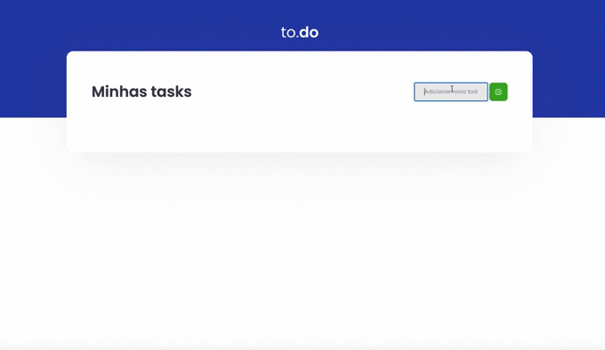

  

## 🚀 Technologies

This project was developed with the following technologies:

- [ReactJS](https://reactjs.org/)
- [TypeScript](https://www.typescriptlang.org/)
- [Babel](https://babeljs.io/)
- [Webpack](https://webpack.js.org/)
- [Sass](https://sass-lang.com/)

## 💻  Getting started

1. Clone this repo using `https://github.com/gustavonobrega/todolist-reactjs`
2. Move to the appropriate directory: `cd todolist-reactjs`. 
3. Run `yarn` to install dependencies. 
4. Run `yarn dev` to see the example app at `http://localhost:8080`.